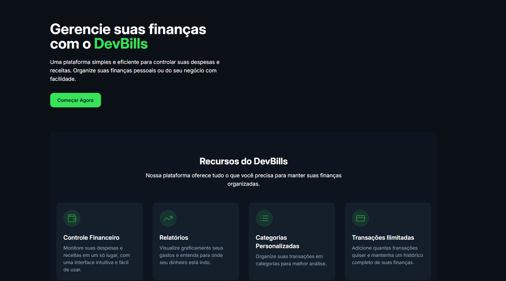
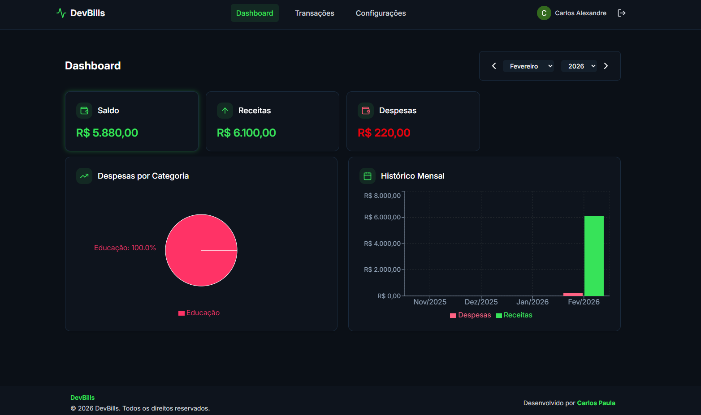
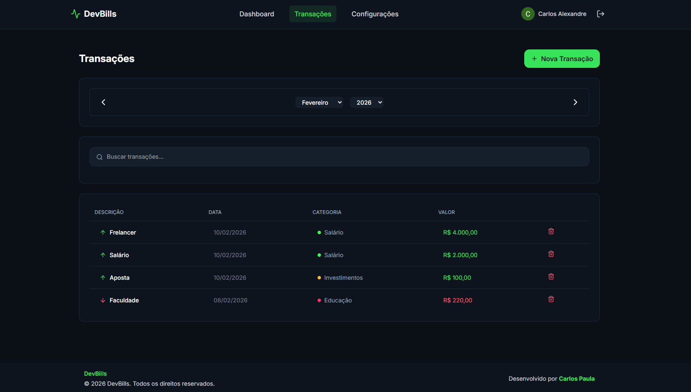

# DevBills Project

Bem-vindo ao **DevBills**, uma aplicação completa para gestão financeira desenvolvida com as melhores práticas de mercado. Este projeto é dividido em uma API robusta e uma interface moderna e responsiva.

## 📸 Screenshots

<div style="display: flex; gap: 10px; flex-wrap: wrap;">
  
  
  
</div>

## 🚀 Tecnologias Utilizadas

### Backend (API)

- **Node.js** com **Fastify**: Framework web rápido e eficiente.
- **TypeScript**: Superset do JavaScript para tipagem estática.
- **Prisma ORM**: Moderno ORM para Node.js e TypeScript.
- **MongoDB**: Banco de dados NoSQL utilizado.
- **Firebase Admin**: Gerenciamento de autenticação e usuários.
- **Zod**: Validação de esquemas e dados.

### Frontend (Interface)

- **React**: Biblioteca JavaScript para construção de interfaces.
- **Vite**: Build tool rápida para desenvolvimento web moderno.
- **Tailwind CSS**: Framework CSS utility-first.
- **Firebase**: Autenticação e serviços backend.
- **React Router**: Roteamento declarativo para React.
- **Recharts**: Biblioteca de gráficos composicional.
- **Axios**: Cliente HTTP baseado em promessas.
- **React Toastify**: Notificações toast para React.

## 📂 Estrutura do Projeto

O projeto é dividido em dois diretórios principais:

- `API`: Contém o código do servidor backend.
- `interface`: Contém o código da aplicação frontend.

## 🛠️ Instalação e Configuração

Siga os passos abaixo para rodar o projeto em sua máquina local.

### Pré-requisitos

- Node.js (versão 18 ou superior recomendada)
- npm ou yarn
- Conta no MongoDB Atlas ou MongoDB local
- Projeto no Firebase configurado

### Configurando o Backend (API)

1. Entre na pasta da API:

   ```bash
   cd API
   ```

2. Instale as dependências:

   ```bash
   npm install
   ```
   ou
   ```bash
   yarn install
   ```

3. Configure as variáveis de ambiente. Crie um arquivo `.env` na raiz da pasta `API` com o seguinte conteúdo (ajuste com suas credenciais):

   ```env
   PORT=3000
   DATABASE_URL="sua_string_de_conexao_mongodb"
   NODE_ENV="dev" # ou "prod"

   # Firebase Admin Config
   FIREBASE_PROJECT_ID="seu_project_id"
   FIREBASE_CLIENT_EMAIL="seu_client_email"
   FIREBASE_PRIVATE_KEY="sua_private_key"
   ```

4. Gere o cliente do Prisma:

   ```bash
   npx prisma generate
   ```
   ou
   ```bash
   yarn prisma generate
   ```

5. Inicie o servidor de desenvolvimento:
   ```bash
   npm run dev
   ```
   ou
   ```bash
   yarn dev
   ```

### Configurando o Frontend (Interface)

1. Entre na pasta da interface:

   ```bash
   cd interface
   ```

2. Instale as dependências:

   ```bash
   npm install
   ```
   ou
   ```bash
   yarn install
   ```

3. Configure as variáveis de ambiente. Crie um arquivo `.env` na raiz da pasta `interface` com o seguinte conteúdo (do seu projeto Firebase):

   ```env
   VITE_FIREBASE_API_KEY="sua_api_key"
   VITE_FIREBASE_AUTH_DOMAIN="seu_auth_domain"
   VITE_FIREBASE_PROJECT_ID="seu_project_id"
   VITE_FIREBASE_STORAGE_BUCKET="seu_storage_bucket"
   VITE_FIREBASE_MESSAGING_SENDER_ID="seu_messaging_sender_id"
   VITE_FIREBASE_APP_ID="seu_app_id"
   ```

4. Inicie o servidor de desenvolvimento:
   ```bash
   npm run dev
   ```
   ou
   ```bash
   yarn dev
   ```

## ✨ Funcionalidades

- **Dashboard Financeiro**: Visão geral de receitas e despesas.
- **Gestão de Transações**: Adicione, liste e visualize suas transações financeiras.
- **Categorização**: Organize suas finanças por categorias.
- **Autenticação Segura**: Login e integração com Google via Firebase.
- **Configurações**: Gerenciamento de perfil e preferências.
- **Responsividade**: Interface adaptável para diferentes dispositivos.

## 📦 Scripts Disponíveis

### API

- `yarn dev`: Inicia o servidor em modo de desenvolvimento com watch.
- `yarn build`: Compila o código TypeScript.
- `yarn start`: Inicia o servidor compilado.

### Interface

- `yarn dev`: Inicia o servidor de desenvolvimento Vite.
- `yarn build`: Compila a aplicação para produção.
- `yarn lint`: Executa o linting no código.

---

Desenvolvido por Carlos Paula